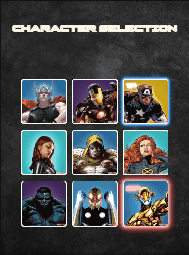

  

 

<h1 align='center'>Character Game Selection </h1>

 

	
	
	

 

_Para a versão em Português, clique [aqui](#portuguese)._

### Topics

- [Project description](#project-description)

- [Technologies used](#technologies-used)

- [What I learned](#what-I-learned)

- [Access the Project](#access-the-project)

 

## Project description

It is the character selection stage of a fictional video game. 
This project was created during the [Mapa dev week](https://mapadevweek.com/) a free course event of the Frontend Course of [DevQuest](https://devemdobro.com/lista/).

 

## Technologies used

 

  
  
  

 

## What I learned

- How to create CSS animations using keyframes;
- How to change the characters images using the repository folder path (on JS);

 

## Access the Project

 

You can [access the project here](https://bo83dev.github.io/marvel-character-selection/) 

 

Desktop 

Mobile

 

  

	
 
	
<h1 align='center'> Character Game Selection </h1>

 

	
	
	

 
	
### Tópicos 

- [Descrição do projeto](#descrição-do-projeto)

- [Tecnologias utilizadas](#tecnologias-utilizadas)

- [O que aprendi](#o-que-aprendi)

- [Acesse o projeto](#acesse-o-projeto)

	
 
	
## Descrição do projeto 

 	

Essa é a etapa de seleção de personagens de um videogame fictício. 
Esse projeto foi desenvolvido durante a [Mapa dev week](https://mapadevweek.com/) um evento gratuito do curso de Frontend [DevQuest](https://devemdobro.com/lista/).

## Tecnologias utilizadas

 	

  
  
  		

 	
## O que aprendi

- Como criar animações com CSS utilizando o keyframes;
- Como trocar as imagens dos personagens usando o caminho da imagem na pasta do repositório;	
	

## Acesse o projeto

Você pode [acessar o projeto aqui](https://bo83dev.github.io/marvel-character-selection/) 

Desktop 

Mobile

Developed with 🧡 by me!  [Carol Vilar](https://www.linkedin.com/in/carolinebarbosavilar/)
